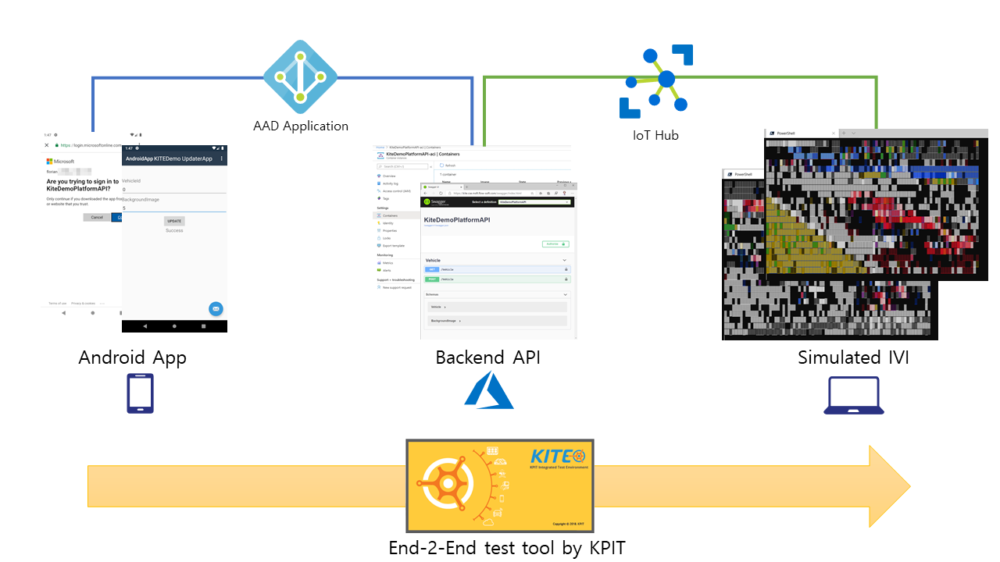

# KITEDemo

Demo environment for KITE

## Architecture - what its all about



## Create or renew certificate

```bash
# Issue Certificate
sudo certbot certonly --manual --preferred-challenges dns

# Create Temp Password
PFX_EXPORT_PASSWORD=$(pwgen 14 1 -c -n -y)

# Create PFX file
cp /etc/letsencrypt/live/YOUR_DOMAIN/privkey.pem .
cp /etc/letsencrypt/live/YOUR_DOMAIN/fullchain.pem .
openssl pkcs12 -inkey privkey.pem -in fullchain.pem -export -out sslcert.pfx -passout pass:"$PFX_EXPORT_PASSWORD"

# Upload to KeyVault
az keyvault certificate import --vault-name KEY_VAULT_NAME -n ssl -f sslcert.pfx --password $PFX_EXPORT_PASSWORD
```

## Create Infrastructure

```bash
cd Infra
.\upsertinfra.ps1 -REPLYURL YOUR_DOMAIN_INCLUDE_HTTPS -PASSWORD $PFX_EXPORT_PASSWORD
```

## DNS Setting

Ensure you create a CNAME for YOUR_DOMAIN towards the ACI fqdn (included in terraform output)

## Run local container (only for debug)

```bash
cd Scripts
.\runapidocker.ps1
```

## Run device container

```bash
cd Scripts
.\runclientdocker.ps1
```

## Get PlatformAPI Access Token

Easy:
Test on Swagger endpoint https://YOUR_DOMAIN/swagger or local https://localhost:5001/swagger

Fiddler/Postman:
Get login URL -> LogIn -> Extract Access Token to use as Bearer token towards API

```bash
cd Scripts
.\getloginurl.ps1
```

## Create settings.json file for Android App

```bash
cd Scripts
.\createandroidappsettings.ps1
```

## Debug Keystore (Android) - already created and checked into repo just FYI

See: https://coderwall.com/p/r09hoq/android-generate-release-debug-keystores

```bash

keytool -genkey -v -keystore debug.keystore -storepass android -alias androiddebugkey -keypass android -keyalg RSA -keysize 2048 -validity 10000
```

Keystore name: "debug.keystore"
Keystore password: "android"
Key alias: "androiddebugkey"
Key password: "android"
CN: "CN=Android Debug,O=Android,C=US"